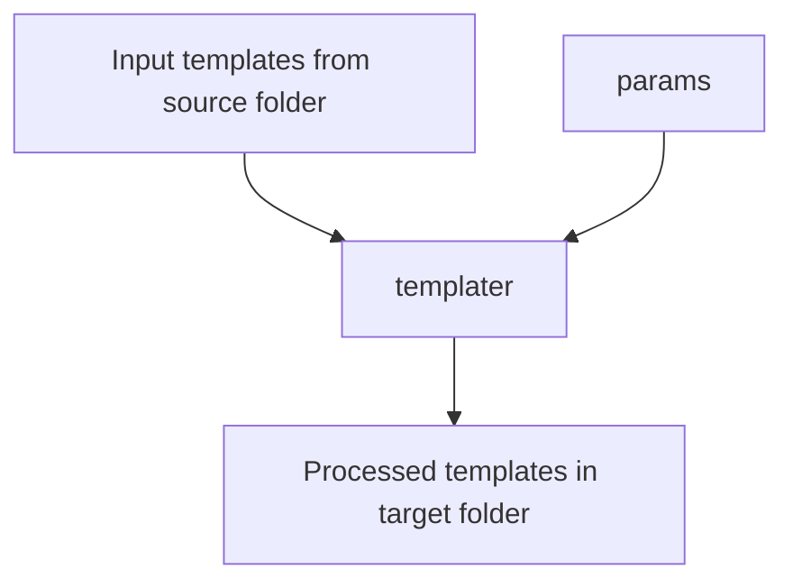

# Templater

A command line application that processes a folder containing freemarker templates and copies the results to a target folder.

Features:
- Freemarker templates support. Files with .ftl extension are to be picked up for processing)
- Processing of file names. Ex. `${param}.yml.ftl`
- Duplication of folders structure and non template files.

Use cases:
- Generation of repetitive configuration that requires many files and folders (Kubernetes configuration files or similar)
- Basic project bootstrapping


_**params** are simple key value entries that are used as input for template processing (interpolation)_.


## Usage

```bash
templater --config=[CONFIG FILE LOCATION] 
```

Available options:

| Option  | Description                                           | Default Value |
|---------|-------------------------------------------------------|---------------|
| help    | Prints help text                                      |               |
| config  | Configuration file. (See configuration example below) | config.json   |
| verbose | Enable verbose logs (Stacktraces, etc)                | false         |

## Configuration File

The configuration file is a JSON file that determines which folder is to be processed including which parameters are to be used.

Example configuration file:

```json
  {
    "sourceFolder": "source",  // source folder where .ftl files will be looked for. Absolute path or relative to config file.
    "targetFolder": "target",  // target folder where processed files will be left. Absolute path or relative to config file.
    "parameters": {            // Params to interpolate. Only simple parameters supported, no nested objects
      "param1": "value1",
      "param2": "value2"
    }
  }
```

## Example

### Initial setup

```
# Source folder contents (C:/source)
├── subfolder
│   └── ${app}-doc.yml
└── something.txt.ftl
```

```
# something.txt.ftl contents
File from ${app}
```

```json
// custom-config.json
  {
    "sourceFolder": "C:/source",
    "targetFolder": "C:/target",
    "parameters": {
      "app": "my-example"
    }
  }
```

### Result

The result of executing `templater --config=C:/custom-config.json` would be the following:

```
# Target folder (C:/target)
├── subfolder
│   └── my-example-doc.yml (Original content intact)
└── something.txt
```

```
# something.txt contents
File from my-example
```
